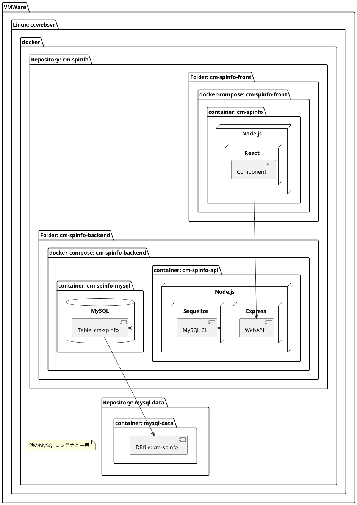

# CCWEB

```plantuml
@startuml

package "VMWare" {
  package "Linux: ccwebsvr" {
    package "docker" {
      package "Repository: cm-spinfo" {
        package "Folder: cm-spinfo-front" {
          package "docker-compose: cm-spinfo-front" {
            package "container: cm-spinfo" {
              node "Node.js" as Node.js_cm-spinfo {
                node "React" as React_cm-spinfo {
                  [Component]
                }
              }
            }
          }
        }

        package "Folder: cm-spinfo-backend" {
          package "docker-compose: cm-spinfo-backend" {
            package "container: cm-spinfo-api" {
              node "Node.js" as Node.js_cm-spinfo-api {
                node "Express" as Express_cm-spinfo-api {
                  [WebAPI]
                }
                node "Sequelize" as Sequelize_cm-spinfo-api {
                  [MySQL CL]
                }
              }
            }
            package "container: cm-spinfo-mysql" {
              database "MySQL" as MySQL_cm-spinfo {
                [Table: cm-spinfo]
              }
            }
          }
        }
      }
      package "Repository: mysql-data" {
        package "container: mysql-data" as container_mysql_data {
          [DBfile: cm-spinfo]
        }
      }
      note left of container_mysql_data
        他のMySQLコンテナと共用
      end note
    }
  }
}

[Component] --> [WebAPI]
[WebAPI] -> [MySQL CL]
[MySQL CL] -> [Table: cm-spinfo]
[Table: cm-spinfo] --> [DBfile: cm-spinfo]

@enduml
```
